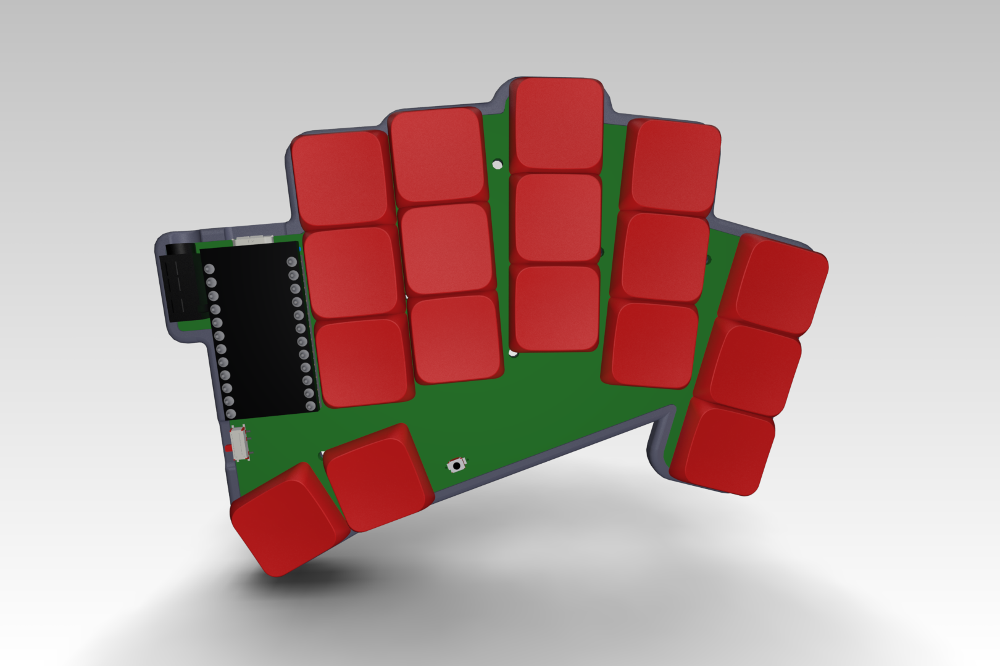
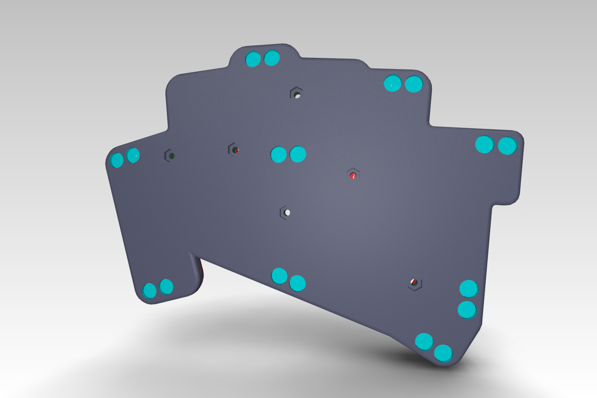
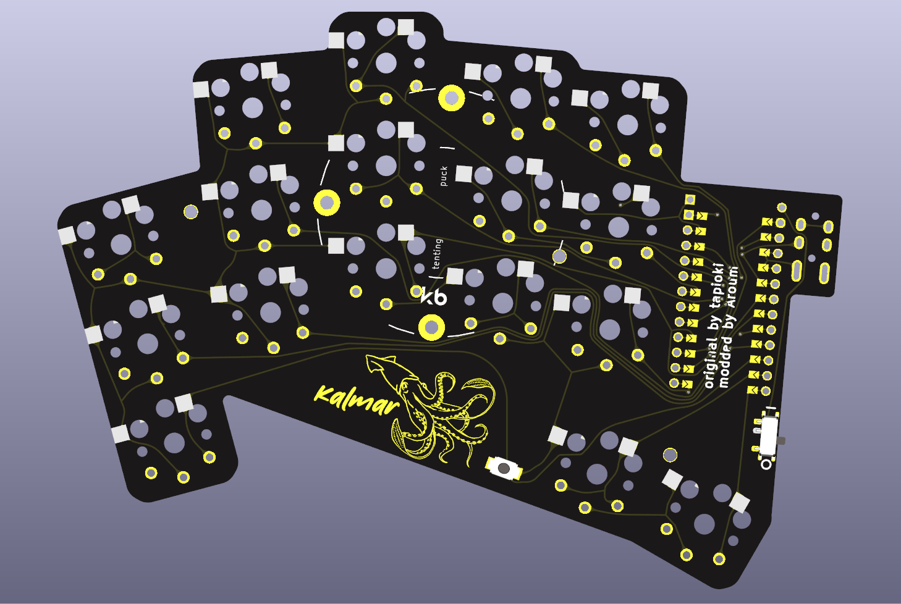

# Kalmar

My [Architeuthis dux](https://github.com/tapioki/cephalopoda/tree/main/Architeuthis%20dux) keyboard modification.

## Differences:
* Power switch
* Reset button
* Solder jumper for ProMicro(no need to flip the controller)
* Low profile case with magnets
* Additional mounting holes for case
  




# BOM for keyboard

| Item                                                                   | Quantity | Remarks                              |
| ---------------------------------------------------------------------- | -------: | ------------------------------------ |
| [proMicro](https://aliexpress.ru/item/32840365436.html)                | 2        | or any other compatible controller   |
| [Kailh Choc V1](https://aliexpress.ru/item/32959996455.html)           | 34       | switches                             |
| [Keycaps](https://aliexpress.ru/item/33026798318.html)                 | 34       | 1U                                   |
| [Magnets](https://aliexpress.ru/item/1005002757445161.html)            | 2-6      | disc 7x2 mm (for case)               |
| [Bumpers](https://aliexpress.ru/item/4001188580018.html)               | 18       | 5x2 mm (for case)                   |
| [Sockets PH3.5](https://aliexpress.ru/item/32899635835.html)           | 12x2     | for controller                       |
| [SMD button 3x4x2mm](https://aliexpress.ru/item/1005003812819985.html) | 2        | for reset                            |
| [MSK-12C02](https://aliexpress.ru/item/1005001398386692.html)          | 2        | Power switch  (wireless only)        |
| [301230](https://aliexpress.ru/item/32732458079.html)                  | 2        | Battery  (wireless only)             |

Interactive BOM is located ```/pcb/ibom/ibom.html```

# GERBER

GERBER can be downloaded in [releases](https://github.com/aroum/kalmar/releases).
